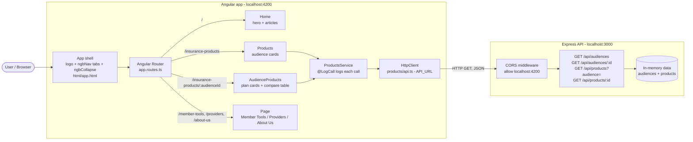

# Architecture

Sri Insurance is an Angular 22 single-page app (styled with Bootstrap / ng-bootstrap) backed by a small Express API that serves sample insurance data from memory.

## Folder layout

| Path | Purpose |
|---|---|
| `src/app/` | Components, routes and app config |
| `src/app/products/api.ts` | API base URL and `Audience` / `Product` types |
| `src/app/products/products.service.ts` | API calls used by the product pages |
| `src/app/decorators/log-call.ts` | `@LogCall` decorator |
| `src/html/` | All component HTML templates |
| `src/tests/` | Angular unit tests, mirroring the `src/app/` folders |
| `public/logo.svg` | Sri Insurance logo |
| `local-api-server/app.js` | Express routes and sample data |
| `local-api-server/server.js` | Starts the API on `PORT` |
| `local-api-server/tests/` | API tests |
