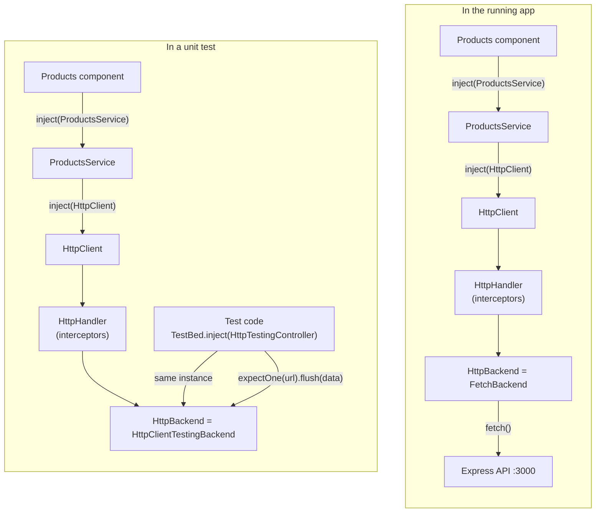

# Dependency injection example: the HTTP client

Dependency injection (DI) means a class asks for the things it needs instead of creating them itself. Angular keeps a registry of **providers** (recipes for creating objects) in **injectors**, and hands out an instance when code asks for one.

This project's clearest example is how the product pages get their data. The pages ask for a `ProductsService`, and the service asks for an `HttpClient`. Nothing creates its own dependencies, which is why the tests can swap in a fake network without changing any component or service code.

## The pieces

| Step | Where | Code |
|---|---|---|
| 1. Register the HTTP providers | `src/app/app.config.ts` | `provideHttpClient()` |
| 2. Hand them to the app's root injector | `src/main.ts` | `bootstrapApplication(App, appConfig)` |
| 3. Ask for them | `src/app/products/products.service.ts`, `products.ts`, `audience-products.ts` | `inject(HttpClient)`, `inject(ProductsService)` |
| 4. Replace one piece in tests | `src/tests/products/*.spec.ts` | `provideHttpClientTesting()` |

## 1. Registering the providers

```ts
// src/app/app.config.ts
export const appConfig: ApplicationConfig = {
  providers: [
    // ...
    provideHttpClient(),
  ],
};
```

`provideHttpClient()` doesn't create anything yet. It returns a list of providers, and the main ones are:

| Token (what code asks for) | Recipe (what it gets) |
|---|---|
| `HttpClient` | A new `HttpClient`. It needs an `HttpHandler`. |
| `HttpHandler` | The interceptor chain, which ends by calling an `HttpBackend`. |
| `HttpBackend` | `FetchBackend`, which sends real requests with the browser's `fetch()`. |

Each piece depends on the next one only through its **token**, not a concrete class. `HttpClient` asks for "an `HttpBackend`", not "a `FetchBackend`". That indirection is what makes swapping possible.

## 2. The root injector

```ts
// src/main.ts
bootstrapApplication(App, appConfig);
```

At startup Angular creates the **root environment injector** from `appConfig.providers`. Everything registered there is shared across the whole app. Every component that asks for `HttpClient` gets the same instance, created the first time something asks for it.

## 3. Asking for it: two levels of `inject()`

The service asks for the HTTP client:

```ts
// src/app/products/products.service.ts
@Injectable({ providedIn: 'root' })
export class ProductsService {
  private http = inject(HttpClient);

  @LogCall
  getAudiences() {
    return this.http.get<Audience[]>(`${API_URL}/audiences`);
  }
  // getAudience(id), getProducts(audienceId) ...
}
```

The page asks for the service:

```ts
// src/app/products/products.ts
export class Products {
  private api = inject(ProductsService);
  protected readonly audiences = rxResource({ stream: () => this.api.getAudiences() });
}
```

What happens when Angular creates the `Products` page:

1. The field initializers run while Angular is creating the component. That period is called the **injection context**, and only there can `inject()` be called. Calling it later, for example in a click handler, throws an error.
2. `inject(ProductsService)` asks the component's injector. It has no provider for `ProductsService`, so the request goes **up the injector tree** to the root injector.
3. `@Injectable({ providedIn: 'root' })` registered `ProductsService` there, so no entry in `app.config.ts` is needed. The root injector creates the service the first time it's asked for, and every page then shares that one instance.
4. Creating the service runs its own `inject(HttpClient)`. That's resolved by the root injector too, from `provideHttpClient()`.

Each class only states *what* it needs. The page knows nothing about URLs or HTTP, and the service doesn't know which backend actually sends the requests. `@LogCall` wraps each service method to log its arguments and response; see [decorators.md](decorators.md).

The same pattern appears more directly in `src/app/app.ts`:

```ts
private router = inject(Router);   // provided by provideRouter(routes) in app.config.ts
```

## 4. Swapping the backend in tests

The tests don't use `appConfig`. Each one builds its own injector with `TestBed`:

```ts
// src/tests/products/products.spec.ts
TestBed.configureTestingModule({
  providers: [provideRouter([]), provideHttpClient(), provideHttpClientTesting()],
});
```

`provideHttpClientTesting()` adds providers that **override** one token:

| Token | In the app | In tests |
|---|---|---|
| `HttpClient` | real | real (unchanged) |
| `HttpHandler` | real | real (unchanged) |
| `HttpBackend` | `FetchBackend` | `HttpClientTestingBackend`, which never touches the network |
| `HttpTestingController` | — | the same `HttpClientTestingBackend` instance |

When two providers register the same token, the later one wins, so `provideHttpClientTesting()` must come **after** `provideHttpClient()`.

The test then asks the injector for the controller and uses it to answer requests:

```ts
const http = TestBed.inject(HttpTestingController);
http.expectOne(`${API_URL}/audiences`).flush(audiences);
```

`HttpTestingController` and `HttpBackend` resolve to the **same object**, so the requests the component sends through `HttpClient` are exactly the ones the test sees in `expectOne`.

## The whole flow



The component, the service and `HttpClient` are identical in both. Only the provider for `HttpBackend` changes.

## Why this matters

- **Components stay simple.** They say what data they need, not how to fetch it.
- **One place to change behavior.** Adding `withInterceptors([...])` to `provideHttpClient()` in `app.config.ts`, for example to add an auth header, affects every request in the app without touching any component.
- **Testable without a server.** Tests replace a single provider and get full control over every response, including errors, with no network calls.
