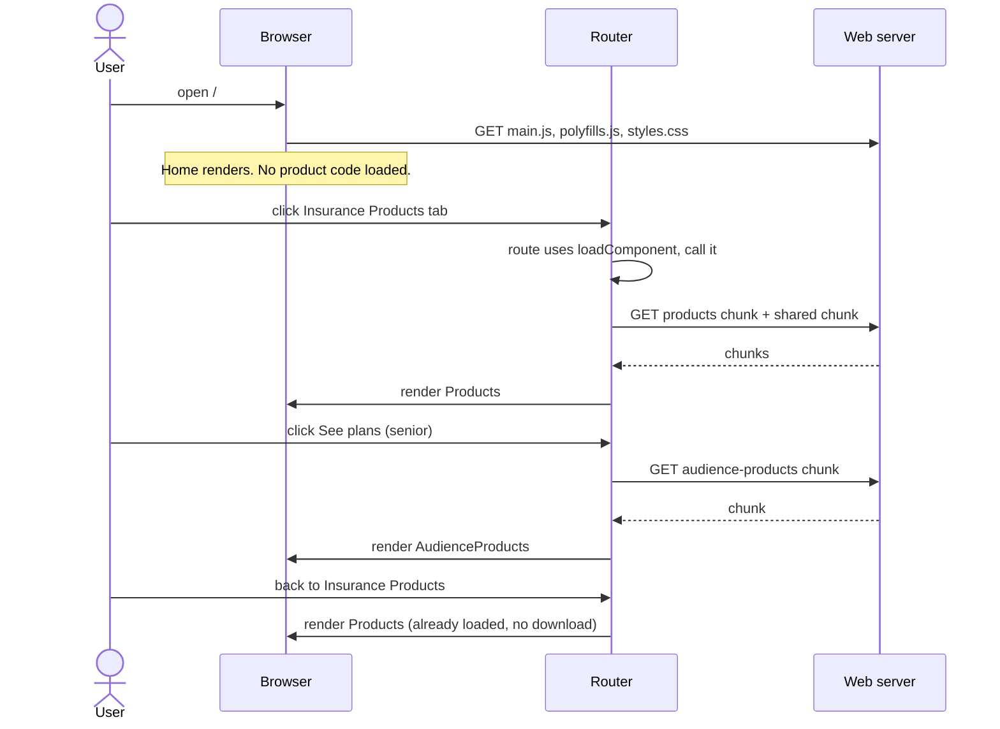

# Lazy loading

Lazy loading means downloading part of the app's code only when it's needed, not all at startup. In this project the two Insurance Products pages are lazy loaded: their code downloads the first time someone opens one of them.

## Eager vs lazy

| | Eager (`component:`) | Lazy (`loadComponent:`) |
|---|---|---|
| When the code downloads | At startup, as part of `main.js` | The first time the route is visited |
| Startup cost | Adds to every visitor's first download | None |
| First visit to the page | Instant | Waits for one small extra download |
| Used here for | Home, Member Tools, Providers, About Us | Insurance Products, and a single audience's plans page |

## How it's set up

```ts
// src/app/app.routes.ts
import { Home } from './home/home';
import { Page } from './page/page';

export const routes: Routes = [
  { path: '', component: Home },
  // Product pages are lazy loaded: each is downloaded the first time it's visited
  {
    path: 'insurance-products',
    loadComponent: () => import('./products/products').then((m) => m.Products),
  },
  {
    path: 'insurance-products/:audienceId',
    loadComponent: () => import('./products/audience-products').then((m) => m.AudienceProducts),
  },
  { path: 'member-tools', component: Page, data: { title: 'Member Tools' } },
  // ...
];
```

Three things make this work:

1. **`loadComponent` instead of `component`.** It takes a function that returns a Promise of the component class. The router only calls it when a user navigates to the route.
2. **A dynamic `import()`.** `import('./products/products')` is a JavaScript expression that loads a file at runtime and returns a Promise of its exports. `.then((m) => m.Products)` picks out the component class.
3. **No normal import of the lazy components.** `Home` and `Page` are imported at the top of the file, but `Products` and `AudienceProducts` are not. A top-level `import { Products } from ...` would put the component in `main.js` again, and lazy loading would silently stop working.

## How the build splits the code

`npm run build` uses esbuild. When it finds a dynamic `import()`, it puts that file, and any code only it uses, into a separate **chunk**. Code used by more than one chunk goes into a shared chunk, so it's only downloaded once.

The build output lists them:

```text
Initial chunk files   | Names             |  Raw size | Estimated transfer size
main-3YBHCUAL.js      | main              | 287.94 kB |                79.11 kB
styles-JG7EAGFK.css   | styles            | 230.85 kB |                22.46 kB
polyfills-OMGXLRKZ.js | polyfills         |  36.38 kB |                11.86 kB

                      | Initial total     | 555.18 kB |               113.44 kB

Lazy chunk files      | Names             |  Raw size | Estimated transfer size
chunk-CAZS-Egs.js     | audience-products |   3.58 kB |                 1.24 kB
chunk-CNu-iMFh.js     | products          |   1.37 kB |               718 bytes
chunk-Cssy8TDk.js     | -                 | 930 bytes |               930 bytes
```

| Chunk | Contains |
|---|---|
| `products` | The audience cards page and its template |
| `audience-products` | The plans page and its comparison table template |
| unnamed (`-`) | Code both pages use: `ProductsService` and the `@LogCall` decorator |

The file names contain a hash of their content, for example `CAZS-Egs`. When the code changes, the name changes, so browsers never use an old cached copy.

## What happens at runtime



Each chunk is downloaded once. The router remembers the loaded component, so later visits are as fast as an eagerly loaded page.

The tab highlighting and route inputs (`audienceId`) work the same as for eager routes. The router only renders the component after the chunk has loaded, and then sets the inputs as usual.

## Services in lazy chunks

`ProductsService` is only used by the product pages, so it ended up in the shared lazy chunk rather than `main.js`. It's still a single app-wide instance:

```ts
@Injectable({ providedIn: 'root' })
export class ProductsService { ... }
```

`providedIn: 'root'` registers the service with the root injector when its code first loads. From then on every page shares it. It's created the first time a product page asks for it, and not before. See [dependency-injection.md](dependency-injection.md).

`HttpClient` stays in `main.js`, because `provideHttpClient()` is listed in `app.config.ts`, which loads at startup.

## Why only the product pages?

| Page | Loading | Reason |
|---|---|---|
| Home | Eager | It's the landing page, so almost every visitor needs it immediately |
| Member Tools, Providers, About Us | Eager | They share the tiny `Page` component. A separate chunk would cost an extra request to save a few hundred bytes. |
| Insurance Products | Lazy | It has its own service, data loading and a larger template, and not every visitor opens it |

## The results

| | Before | After |
|---|---|---|
| Startup JavaScript and CSS | 560.21 kB (114.75 kB compressed) | 555.18 kB (113.44 kB compressed) |
| Lazy chunks | none | 5.88 kB in total, only for visitors who open the product pages |

The saving is small because the product pages are small. Most of `main.js` is Angular, the router and ng-bootstrap, which every page needs.

The build still warns about Angular's 500 kB budget. That's mostly Bootstrap's 231 kB stylesheet, which lazy loading JavaScript doesn't reduce. The benefit grows as pages grow: a Member Tools dashboard with a charting library, for example, would keep that library out of every visitor's startup download.

## Checking that it works

- **Build output:** after `npm run build`, the page should be listed under "Lazy chunk files". If it's missing, look for a top-level import of the component somewhere in the app.
- **Browser DevTools:** open the Network tab and filter by JS. Load `/`, then click Insurance Products. The new `chunk-*.js` requests appear only after the click.

## Testing

Lazy loading doesn't change the tests:

- The component tests in `src/tests/products/` import `Products` and `AudienceProducts` directly, so the router isn't involved.
- `src/tests/app.spec.ts` uses the real routes and navigates to `/insurance-products/senior`. That runs the real `loadComponent` and the dynamic `import()`. The test awaits `router.navigateByUrl(...)`, which only resolves once the component has loaded, so no extra waiting is needed.

## Going further

**Preloading.** To keep startup fast but make the first visit to a lazy page instant, the router can download lazy chunks in the background once the app has started:

```ts
// src/app/app.config.ts
provideRouter(routes, withComponentInputBinding(), withPreloading(PreloadAllModules)),
```

This adds about 2 kB to `main.js` for the preloader, and every visitor then downloads the lazy chunks, just not at startup.

**Default exports.** If a component file uses `export default class Products`, the `.then()` isn't needed: `loadComponent: () => import('./products/products')`.

**Lazy groups of routes.** When a section grows several pages, `loadChildren` can lazy load a whole list of routes from a separate file:

```ts
{ path: 'member-tools', loadChildren: () => import('./member-tools/member-tools.routes').then((m) => m.routes) },
```

**Lazy parts of a page.** `@defer` in a template lazy loads a component inside a page, for example a heavy chart that's only shown when scrolled into view:

```html
@defer (on viewport) {
  <app-claims-chart />
} @placeholder {
  <p>Loading chart…</p>
}
```

## Adding a lazy page

1. Create the component in `src/app/`, with its template in `src/html/`.
2. Add a route with `loadComponent: () => import('./path/to/file').then((m) => m.YourPage)`, above the `**` wildcard.
3. Don't import the component class anywhere outside its own folder, except in tests.
4. Run `npm run build` and check the new chunk appears under "Lazy chunk files".
