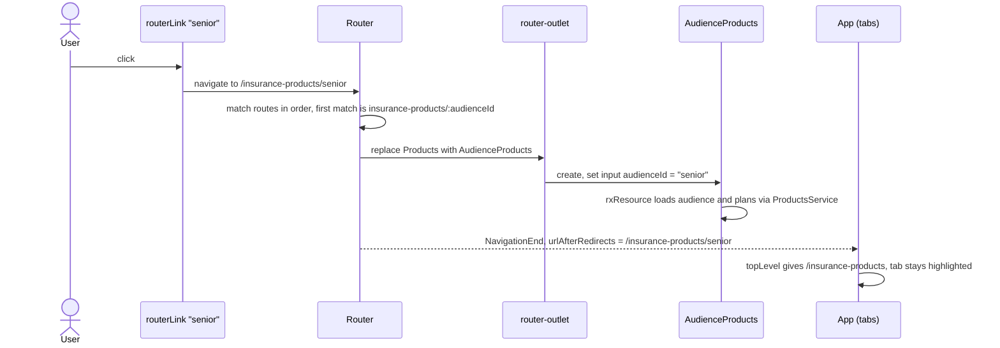

# Routing

The app is a single-page application. The browser loads `index.html` once, and after that the Angular Router swaps page components in and out as the URL changes, without reloading the page.

Routing involves five files:

| File | Role |
|---|---|
| `src/app/app.routes.ts` | The route table: which URL shows which component |
| `src/app/app.config.ts` | Registers the router with `provideRouter(...)` |
| `src/html/app.html` | The layout: logo and tab links, plus `<router-outlet />` where pages appear |
| `src/app/app.ts` | Works out which tab to highlight from the current URL |
| `src/html/products.html`, `audience-products.html` | Links between the products pages |

## The route table

```ts
// src/app/app.routes.ts
export const routes: Routes = [
  { path: '', component: Home },
  // Product pages are lazy loaded: each is downloaded the first time it's visited
  {
    path: 'insurance-products',
    loadComponent: () => import('./products/products').then((m) => m.Products),
  },
  {
    path: 'insurance-products/:audienceId',
    loadComponent: () => import('./products/audience-products').then((m) => m.AudienceProducts),
  },
  { path: 'member-tools', component: Page, data: { title: 'Member Tools' } },
  { path: 'providers', component: Page, data: { title: 'Providers' } },
  { path: 'about-us', component: Page, data: { title: 'About Us' } },
  { path: '**', redirectTo: '' },
];
```

| URL | Component | Notes |
|---|---|---|
| `/` | `Home` | Hero banner and articles. The logo links here. |
| `/insurance-products` | `Products` | Audience cards. Lazy loaded. |
| `/insurance-products/individual` (or `senior`, `business`) | `AudienceProducts` | `:audienceId` is a **route parameter**: whatever is in that part of the URL is passed to the component. Lazy loaded. |
| `/member-tools`, `/providers`, `/about-us` | `Page` | One shared component. The title comes from each route's `data`. |
| Anything else, for example `/does-not-exist` | none | `**` matches any URL, and `redirectTo: ''` sends it to Home |

The router checks routes **in order** and uses the first match, so `**` must stay last. Paths are written without a leading `/`.

`insurance-products` and `insurance-products/:audienceId` don't conflict. By default a path must match the **whole** URL, so `/insurance-products/senior` doesn't match the shorter path and moves on to the next route.

## Lazy loading

The two product routes use `loadComponent` instead of `component`, so their code is split into separate files that download the first time someone opens those pages. Home and the shared `Page` stay in the main bundle.

See [lazy-loading.md](lazy-loading.md) for how the build splits the code, what downloads when, the size results and how to check it's working.

## Registering the router

```ts
// src/app/app.config.ts
provideRouter(routes, withComponentInputBinding()),
```

- `provideRouter(routes)` registers the router and the route table with the app's root injector. See [dependency-injection.md](dependency-injection.md) for how providers work.
- `withComponentInputBinding()` lets the router pass values from the URL straight into component **inputs**. The next section shows how the project uses this.

## Passing values into pages

With `withComponentInputBinding()`, the router fills a component's inputs from route parameters, route `data` and query parameters, matching each input by name.

**Route parameter, for the audience page:**

```ts
// src/app/products/audience-products.ts
readonly audienceId = input.required<string>();
```

For `/insurance-products/senior`, the router sets `audienceId` to `'senior'` because the input's name matches `:audienceId` in the route. The component uses it to build its API URLs, and because each `rxResource` reads it as a signal in `params`, it re-fetches automatically if the id changes.

**Route data, for the shared page:**

```ts
// src/app/page/page.ts
readonly title = input<string>();
```

For `/providers`, the route's `data: { title: 'Providers' }` sets `title`. This is how one `Page` component serves three routes with different headings.

Components don't need to know about the router. They just declare inputs, which is also why the unit tests can set them directly with `fixture.componentRef.setInput(...)`.

## The layout and `<router-outlet>`

```html
<!-- src/html/app.html (simplified) -->
<header>
  <a routerLink="/">logo</a>
  <ul ngbNav [activeId]="activeTab()">
    @for (tab of tabs; track tab.path) {
      <li [ngbNavItem]="tab.path"><a ngbNavLink [routerLink]="tab.path">{{ tab.label }}</a></li>
    }
  </ul>
</header>
<main>
  <router-outlet />
</main>
```

`App` is the root component and never changes. The header stays on screen, and the router renders the matching page component inside `<router-outlet />`.

## Links

`routerLink` turns an `<a>` into a router link. Clicking it changes the URL and swaps the page without a full page reload. It also sets a real `href`, so opening in a new tab and copying the link still work.

| Link | Where | Type |
|---|---|---|
| `routerLink="/"` | Logo, `app.html` | Absolute |
| `[routerLink]="tab.path"`, for example `/providers` | Tabs, `app.html` | Absolute |
| `routerLink="/insurance-products"` | "All products" back link, `audience-products.html` | Absolute |
| `[routerLink]="a.id"`, for example `senior` | "See plans" buttons, `products.html` | **Relative** |

Links starting with `/` are **absolute**. The "See plans" link has no leading `/`, so it's **relative** to the current route. On `/insurance-products`, `senior` becomes `/insurance-products/senior`. If the products page ever moves to a different URL, those links follow it automatically.

In the unit tests, the component is created without the real routes, so the same relative link resolves to `/senior`. That's why `products.spec.ts` expects `['/individual', '/senior']`.

## Highlighting the current tab

The tabs use ng-bootstrap's `ngbNav`, which highlights the item whose id matches `activeId`. Each tab's id is its path, so the app only has to work out which path is current:

```ts
// src/app/app.ts
protected readonly activeTab = toSignal(
  this.router.events.pipe(
    filter((e) => e instanceof NavigationEnd),
    map((e) => topLevel(e.urlAfterRedirects)),
  ),
  { initialValue: topLevel(this.router.url) },
);

// '/insurance-products/senior' -> '/insurance-products' so the parent tab stays highlighted
function topLevel(url: string) {
  return '/' + url.split(/[/?#]/)[1];
}
```

1. **Listen for navigations.** The router emits several events for every navigation. `NavigationEnd` means it finished successfully.
2. **Use the final URL.** `urlAfterRedirects` is the URL after any redirect, so `/does-not-exist` reports `/`, not the address the user typed.
3. **Keep only the first part.** `topLevel` cuts the URL at the next `/`, `?` or `#`:

   | URL | `topLevel` | Highlighted tab |
   |---|---|---|
   | `/` | `/` | none. No tab has that id. |
   | `/providers` | `/providers` | Providers |
   | `/providers?ref=email` | `/providers` | Providers |
   | `/insurance-products/senior` | `/insurance-products` | Insurance Products |

4. **Turn it into a signal.** `toSignal` converts the event stream into a signal the template can read with `activeTab()`.
5. **Start with a value.** `initialValue` sets the value before the first navigation finishes. Without it, `activeTab()` would start as `undefined`, and `ngbNav` treats that as "nothing chosen" and highlights the **first** tab. Before this fix, "Insurance Products" was wrongly highlighted on the Home page.

## Closing the mobile menu

On narrow screens the tabs sit in a collapsible menu (`[ngbCollapse]="menuCollapsed"`). Each tab and the logo also have `(click)="menuCollapsed = true"`, so picking a page closes the menu. That's separate from routing: the router changes the page, and the click handler closes the menu.

## Navigation flow

What happens when a user clicks "See plans" on the Seniors card:



For the API calls that follow, see [sequence-diagram.md](sequence-diagram.md).

## Deep links and hosting

Typing or refreshing a URL such as `/insurance-products/senior` sends a real request to the server for that path. `ng serve` handles this by returning `index.html` for any unknown path, and the router then shows the right page.

When deploying the build in `dist/sri-insurance/browser/`, configure the web server the same way: serve `index.html` for any path that isn't a real file. Otherwise refreshing any page except `/` returns a 404 from the server.

## Adding a new page

1. Create the component in `src/app/`, with its template in `src/html/`.
2. Add a route to `app.routes.ts` **above** the `**` wildcard. For a page with a lot of its own code, use `loadComponent: () => import('./path').then((m) => m.YourPage)` and don't import the class at the top of the file.
3. For a new tab, add `{ path: '/your-path', label: 'Your Label' }` to `tabs` in `app.ts`. The tab highlighting works automatically.
4. Add a test in `src/tests/`. To check the tab, add a case to `src/tests/app.spec.ts`, which uses the real routes.
