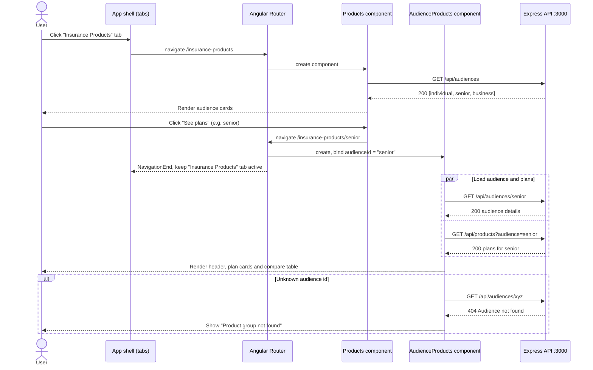

# Sequence: browsing insurance products

The user opens the Insurance Products tab, then picks an audience to see and compare its plans.

```mermaid
sequenceDiagram
  actor User
  participant App as App shell (tabs)
  participant Router as Angular Router
  participant Products as Products component
  participant Audience as AudienceProducts component
  participant API as Express API :3000

  User->>App: Click "Insurance Products" tab
  App->>Router: navigate /insurance-products
  Router->>Products: create component
  Products->>API: GET /api/audiences
  API-->>Products: 200 [individual, senior, business]
  Products-->>User: Render audience cards

  User->>Products: Click "See plans" (e.g. senior)
  Products->>Router: navigate /insurance-products/senior
  Router->>Audience: create, bind audienceId = "senior"
  Router-->>App: NavigationEnd, keep "Insurance Products" tab active

  par Load audience and plans
    Audience->>API: GET /api/audiences/senior
    API-->>Audience: 200 audience details
  and
    Audience->>API: GET /api/products?audience=senior
    API-->>Audience: 200 plans for senior
  end
  Audience-->>User: Render header, plan cards and compare table

  alt Unknown audience id
    Audience->>API: GET /api/audiences/xyz
    API-->>Audience: 404 Audience not found
    Audience-->>User: Show "Product group not found"
  end
```
